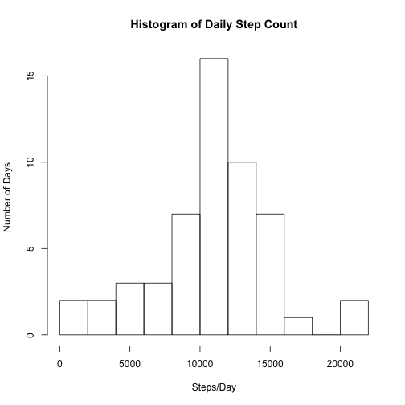
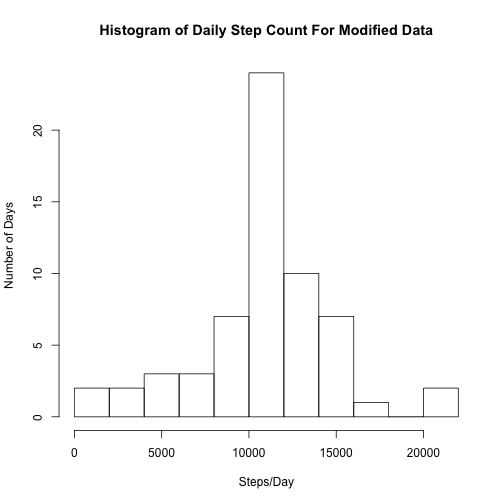
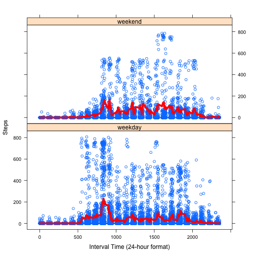

Report for Peer Assignment #1 in Reproduceable Research

The data to be analysed is pedometer reading generated by an anonymouns individual.  The data was gathered over 2 months, and the actual "step" are binned in to 5-minute interval.  There are a total of 17568 5-minute interval records.  Each record consisted of a "step", "data", and "interval" entry.

The data was provided as part of the assignment.  Data file is "activity.csv", and is in a simple CSV format with 1 header.

Load necessary packages

```r
library("markdown", lib.loc="/Library/Frameworks/R.framework/Versions/3.2/Resources/library")
library("lattice", lib.loc="/Library/Frameworks/R.framework/Versions/3.2/Resources/library")
library("knitr", lib.loc="/Library/Frameworks/R.framework/Versions/3.2/Resources/library")
library("htmltools", lib.loc="/Library/Frameworks/R.framework/Versions/3.2/Resources/library")
library("rmarkdown", lib.loc="/Library/Frameworks/R.framework/Versions/3.2/Resources/library")
```

## Loading and preprocessing the data
Set working directory that contains data and 'figure' folder.

```r
setwd("/Users/seantreadway/data_analysis/repo/RepData_PeerAssessment1")
```
Here the data is read in to R.

```r
#Set number of record/lines.  Given in instructions, checked with 'wc' at command line
records=17568
#Set the colume classes
classes<-c("numeric","Date","numeric")
#Set column names.  Comes from header
cnames=c("steps","date","interval")
#Read in data
alldata<-read.delim("./activity.csv",header=TRUE,sep=",", nrows=records,colClasses=classes,strip.white=TRUE)
```

## What is mean total number of steps taken per day?
The first part of the assigment was to determine the mean, and median daily steps, and to plot a histogram of daily steps.
NAs in the step entries were ignored for this part of the analysis.

```r
#Create a logical vector for selecting records with out step NAs
goodrows<-!is.na(alldata$steps)
#Create total steps per day vector
daily<- as.vector(tapply(alldata[goodrows,]$steps,alldata[goodrows,]$date,sum))
#Determine the mean and median daily steps, ignoring NAs
dailymean<-mean(daily)
dailymedian<-median(daily)
dailymean
```

```
## [1] 10766.19
```

```r
dailymedian
```

```
## [1] 10765
```
The mean total steps was 10766.189, and the median 10765.


## What is the average daily activity pattern?
Just below is the histogram for total daily steps.  NA were omitted.

```r
#Create histogram showing daily step count frequency
hist(daily,breaks=10,main="Histogram of Daily Step Count",xlab="Steps/Day",ylab="Number of Days")
```

 


```r
#Determine the mean for each interval.  This will be used to fill in the step NAs.  
#This totally ignores day/week/month differences that might exist, and any trends in activity. 
#Ignoring these simplifies the analysis for the sake of the exercise.
intmeans24<-tapply(alldata$steps,alldata$interval,mean,na.rm=TRUE)
#Determine what interval sees the highest mean number of steps
max(intmeans24)
```

```
## [1] 206.1698
```

```r
which.max(intmeans24)
```

```
## 835 
## 104
```
The greatest number of step was typically taken between 835 and 840 AM (interval 104), with about 206 steps on average for the entire 2 month period.  NAs were omitted.

Here is a plot of average steps for each interval.  

```r
#Plot the mean number of steps on an interval basis
plot(intmeans24,type='l',xlab="Interval (5-minute increment)",ylab="Mean Steps",main="Interval Step Average Across 2 Months")
```

 

## Imputing missing values
The data is modified to substitute something meaningful in for the 2304 NA step entries.
I chose average for each interval across the 2 month period. Zero (0) was assumed in the case of NA for intervals across the entire time.

```r
sub<-function(record){
        
        if(is.na(record[1])) {
                record[1]<-intmeans24[as.character(record[2])]
        }
        return(record[1])
}
moddata<-alldata
moddata$steps<-apply(subset(alldata, select=c(steps,interval)),1,sub)

moddaily<- as.vector(tapply(moddata$steps,moddata$date,sum))
#Count of NA values
NAcount<-records-sum(goodrows)
moddailymean<-mean(moddaily)
moddailymean
```

```
## [1] 10766.19
```

```r
moddailymedian<-median(moddaily)
moddailymedian
```

```
## [1] 10766.19
```
The modified daily mean, 10766.189 is basically identical to the unmodified data mean.
The modified daily median is up slightly to 10766.189.

Histogram of modified daily steps is just below.

```r
hist(moddaily,breaks=10,main="Histogram of Daily Step Count For Modified Data",xlab="Steps/Day",ylab="Number of Days")
```

 

Modification of the data resulted in basically no change in the data trends.  Day frequency count is up, reflecting a more complete data record.

## Are there differences in activity patterns between weekdays and weekends?
We would like to explore differences between weekday and weekend step counts.  To do this, a two-level factor is added to the modified data set.  The two levels are "weekday" and "weekend".  The factors were are determined based on the day of the week entry already added to each record.

```r
#Create a factor for day-of-week section.
moddata$day<-weekdays(moddata$date)

daytype<-function(testday){
        MF<-c('Monday','Tuesday','Wednesday','Thursday','Friday')
        if(testday %in% MF) {
                testday<-"weekday"
        }
        else {
                testday<-"weekend"
        }
        return(testday)
}
```


```r
moddata$daytype<-as.factor(sapply(moddata$day, daytype))
```

Here, a lattice type plot is create to compare the step count for weekends and weekdays.

```r
xyplot(steps~interval | daytype ,moddata, layout=c(1,2),aspect='fill',xlab='Interval Time (24-hour format)',ylab='Steps', panel=function(x,y){
               panel.xyplot(x,y)
               panel.average(x,y,horizontal = FALSE,col.line = 'red',lwd=5)
       })
```

 

Using the filled data set, this plot attempts to compare the interval step difference for weekdays to weekends.  The blue circles are all the step counts for the intervals across the 2-month period.  The red line illustates an average for those points.  The averaging lines seem to indicate an earlier start on steps at the beginning of the day on weekdays.  

Some observations can be made using these graphs.  Peak steps occurs in the morning during weekdays, and late afternoon on weekends.  Activity through weekend days appears more even, with noticably more activity over the middle of the day as compared to weekdays.  Overall, weekday mornings are with the most steps occured.  Peak steps per 5-minute interval seldom exceeds 800, and never by much. The red average line confirms the peak average of about 200 step occuring at 830 for all days.

